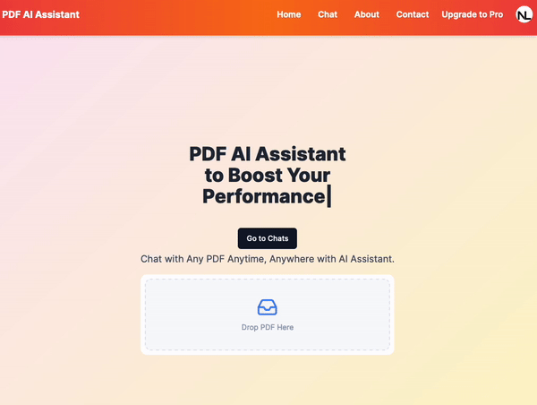
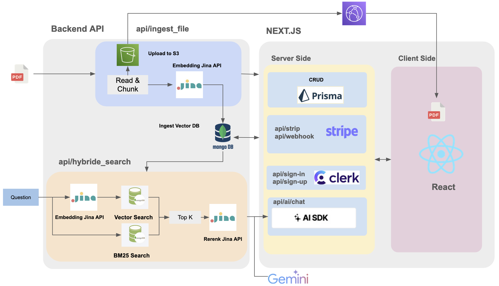

# PDF AI Assistant: A Full Stack SaSS RAG (Retrieval Augmented Generation) Application

## Introduction
The SaSS application is based on the [`youtube video`](https://www.youtube.com/watch?v=r895rFUbGtE&t=15158s) with the secondary development.   
A modern full-stack web application that allows users to upload PDF files, perform hybrid search on the contents, and engage in AI-powered chat conversations powered by Google Genimi.


## Highlights
- MongoDB Atlas for storage, vector search, keyword search and customized hybrid search.
- Backend APIs for file uploading,context retrieval deployed by CloudRun and AWS Lambda.
- Google Genimi API for chat generation
- Purely chat mode available to disable reading PDF
- Jina AI for embedding and retrieving reranking
- UI optimizations for model devices


## Preview

[`www.chat-pdf-ai.com`](www.chat-pdf-ai.com)




## Overall Architecture

Backend API Github:  https://github.com/Nelsonlin0321/chat-pdf-ai-assistant-fastapi



### Backend:

- The FastAPI server acts as the main backend API, handling complex logic.
- It uses the Jina framework for embedding text data and reranking for retrieval data.
- MongoDB act the the backend database and perform vector similarity and keyword search operations for ingested vector and text. 
- The custom "Read & Chunk" component to preprocessing PDF files, splitting pages to sentence and them merge them into chunks for embedding and indexing.
- The "api/hybrid_search" route handle hybrid search queries, combining traditional text search (BM25) with vector similarity search with Jina AI reranking.

### Frontend:

-  The frontend is built with the Next.js React framework, providing server-side rendering and static site generation capabilities.
-  It integrates with third-party services like Stripe for payment processing, Clerk for user authentication (sign-in, sign-up), and an AI SDK for chat functionality (api/ai/chat).
- The frontend communicates with the backend API for CRUD operations, managing data related to the application's core functionality.
- Vercel is used for hosting and deploying the Next.js frontend application.

### Data Flow:

- PDF files are ingested through the backend API (api/ingest_file) and processed (read, chunked, embedded) before storing in the vector database.
- User queries (questions) are embedded using the Jina API, and vector similarity search is performed against the ingested vector database to retrieve relevant chunks or documents.
- The retrieved chunks are re-ranked using the Rerank Jina API and other algorithms (BM25) to produce the final search results.
- The frontend interacts with the backend API to fetch and display these search results, as well as to handle other functionality like authentication, payments, and AI-powered chat.


## Run Locally

```bash
npm run install
npm run dev
```

Open [http://localhost:3000](http://localhost:3000) with your browser to see the result.


## env

```shell
# Clerk
NEXT_PUBLIC_CLERK_PUBLISHABLE_KEY
CLERK_SECRET_KEY=
NEXT_PUBLIC_CLERK_SIGN_IN_URL=/sign-in
NEXT_PUBLIC_CLERK_SIGN_UP_URL=/sign-up
NEXT_PUBLIC_CLERK_AFTER_SIGN_IN_URL=/
NEXT_PUBLIC_CLERK_AFTER_SIGN_UP_URL=/

# DATABASE_URL
DIRECT_DATABASE_URL=
DATABASE_URL=

NEXT_PUBLIC_S3_ROOT_DIR=chatpdf

NEXT_PUBLIC_LAMBDA_BACKEND_URL=
NEXT_PUBLIC_CLOUDRUN_BACKEND_URL=

GOOGLE_API_KEY=

STRIPE_API_KEY=

STRIPE_WEBHOOK_SIGNING_SECRET=

NEXT_BASE_URL="http://localhost:3000"

SENTRY_AUTH_TOKEN=
```
