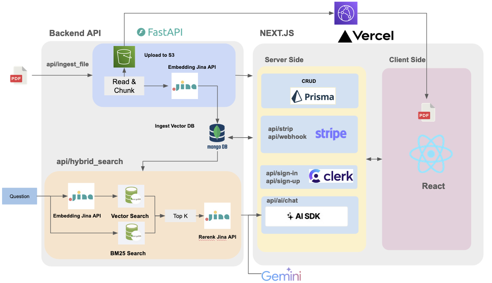

# PDF AI Assistant: A Full Stack SaSS RAG (Retrieval Augmented Generation) Application

## Introduction
The ChatPDF application is based on the [`youtube video`](https://www.youtube.com/watch?v=r895rFUbGtE&t=15158s) with the secondary development.   
The application allow users to upload PDF document and ask questions related to the selected document. It achieves this by retrieving pertinent data or documents related to a specific question or task and utilizing them as contextual information for the LLM.

## Highlights
- MongoDB Atlas for storage, vector search, keyword search and customized hybrid search.
- Backend APIs for file uploading,context retrieval deployed by CloudRun and AWS Lambda.
- Google Genimi API for chat generation
- Purely chat mode available to disable reading PDF
- Jina AI for embedding and retrieving reranking
- UI optimizations for model devices


## Preview

[`www.chat-pdf-ai.com`](www.chat-pdf-ai.com)


## Overall Architecture

Backend API Github:  https://github.com/Nelsonlin0321/webdev-chat-pdf-api




## Run Locally

```bash
npm run install
npm run dev
```

Open [http://localhost:3000](http://localhost:3000) with your browser to see the result.


## env

```shell
# Clerk
NEXT_PUBLIC_CLERK_PUBLISHABLE_KEY
CLERK_SECRET_KEY=
NEXT_PUBLIC_CLERK_SIGN_IN_URL=/sign-in
NEXT_PUBLIC_CLERK_SIGN_UP_URL=/sign-up
NEXT_PUBLIC_CLERK_AFTER_SIGN_IN_URL=/
NEXT_PUBLIC_CLERK_AFTER_SIGN_UP_URL=/

# DATABASE_URL
DIRECT_DATABASE_URL=
DATABASE_URL=

NEXT_PUBLIC_S3_ROOT_DIR=chatpdf

NEXT_PUBLIC_LAMBDA_BACKEND_URL=
NEXT_PUBLIC_CLOUDRUN_BACKEND_URL=

GOOGLE_API_KEY=

STRIPE_API_KEY=

STRIPE_WEBHOOK_SIGNING_SECRET=

NEXT_BASE_URL="http://localhost:3000"

SENTRY_AUTH_TOKEN=
```
